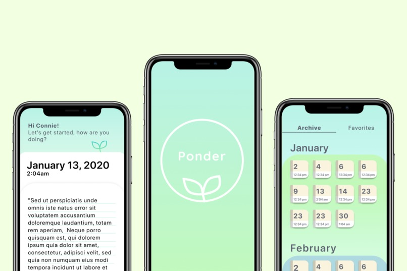

# Ponder - a journal app that uses Wit.Ai to recommend tailored articles for mental health and self-improvement

This project was submitted to the <strong>2020 Online Facebook AI Hackathon</strong>. Our Devpost submission can be found <a href="https://devpost.com/software/ponder-tiw5y3">here</a>, and our pitch video can be found <a href="https://youtu.be/S9EuC72BRVw">here</a>.

## Inspiration

The coronavirus pandemic has taken a toll on people’s mental health around the world. Millions of people are isolated from a support system, and with the priorities of our day to day activities changed, it’s not uncommon for many to have feelings of anxiety and uncertainty.

Research has shown that journaling helps people improve their mental health as it’s a way for them to regain control over their emotions. To help facilitate journaling with additional support, we integrated with Wit.ai to use AI to recommend resources that would help users feel supported based on what they journaled.

## What it does

Ponder is a journal that uses Wit.ai to recommend various articles and resources specifically tailored towards the user's journal entry for the day. This helps the user reflect deeper on their emotions and help facilitate beneficial changes to their lifestyle. Each journal entry is paired with a related article, and these pairs can be archived for easy access in the future. The user can look at their history to see their progress, and we also provide a virtual plant to illustrate personal "growth" by measuring their app usage.

## How we built it

We first used Figma to visually prototype our app, working from sketches and wireframes. We then used Dart and Flutter to construct the front-end of the app, as well as MongoDB for database storage, Mongoose for the REST API, and Wit.ai for sentiment analysis.

## Challenges we ran into

Since we are a large team and we were working on integrating many different frameworks, we ran into the major challenge of learning new languages and frameworks in a short amount of time.

The design team had to learn how to integrate a plethora of different ideas into one prototype that could also be implemented by the rest of our team.

For the frontend team, we both picked up Dart and Flutter for the first time. After learning the ropes, one major challenge we bumped into was configuring the navigation bar to allow for in-page routing.

For the backend, a major challenge was learning how to leverage Wit.AI to produce relevant results.

## Accomplishments that we're proud of

We worked extremely well as a remotely organized team, from ideation to submission. Each person on the team was always willing to chip in where needed and took care of their own deliverables as well.

Additionally, a majority of our team had never used any of the tools listed for creating this product. We are proud of how much we have all learned during this endeavor and of our ability to adapt to use new techniques and resources.

## What we learned

The frontend team learned how to use Flutter and Dart, experimenting with mobile development for the first time. The backend team learned how to integrate Wit.ai into the multiple technical components that were being used, as well as how to query in Dart. On the design side, we learned how to organize and maintain a large team remotely, as well as how to shorten but efficiently do the UX research portion.

## What's next for Ponder

We hope to allow Ponder to support a wider variety of media (videos, research journals, etc.). Another area of focus is to accommodate for a larger range of journaled situations and topics.

## Technologies used

Languages: Dart, Javascript
Technologies: Flutter, MongoDB, Mongoose, Wit.ai, Figma

## Notes

The backend is currently being run by a heroku server.
In order to run this project make sure to download XCode on Mac or the Android simulator if on windows as well as Flutter according to this: https://flutter.dev/docs/get-started/install

Once you have a simulator up and flutter installed, type flutter run in the project directory in the terminal and the app should open up in the simulator. Contact us if there are any issues.

APK Files here: https://github.com/jonnachen/ponder_front/tree/master/apk

<em>Favorites feature only functional after user logs out and logs back in.</em>

## Sample use for testing:

username: steven

password: broski123
